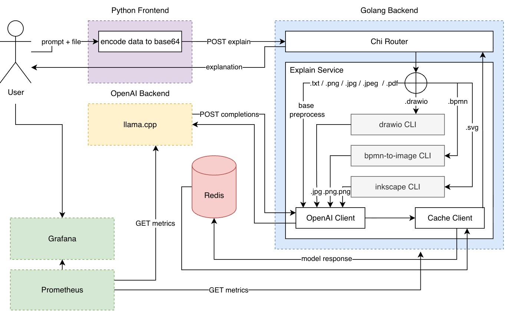

# Diagram AI Converter

<div id="stack-badges">
    <a href="https://www.python.org/">
        
    </a>
    <a href="https://golang.org/">
        
    </a>
    <a href="https://github.com/ggerganov/llama.cpp">
        
    </a>
    <a href="https://redis.io/">
        
    </a>
    <a href="https://grafana.com/">
        
    </a>
    <a href="https://prometheus.io/">
        
    </a>
</div>

-----

**The winner of ITMO Megaschool 2026**: top 1

-----

A system for automatically analyzing and explaining diagrams of multiple formats. Designed for both CPU and GPU environments. Key features:

- **multi-format support** – convert and understand `.drawio`, `.png`, `.jpg`, `.jpeg`, `.svg`, `.bpmn`, `.txt`, `.pdf`

- **light-weighted VLM model** quantized [`openbmb/MiniCPM-V-4_5-gguf`](https://huggingface.co/openbmb/MiniCPM-V-4_5-gguf) (can be replcaced) with `llama.cpp` backend

- **optimized for CPU and GPU** with benchmarks demonstrating low latency for small and large diagram sets

- **streaming-ready backend** – fast and memory-efficient Golang service that can handle real-time streaming of diagram data

- **response caching** – Redis-based caching to avoid redundant processing and reduce load on LLM inference

- **observability included** – built-in Grafana + Prometheus monitoring for key metrics across the system

- **lightweight frontend** – simple interactive Python + Gradio interface

## Architecture

The system follows a modular microservice architecture, where each component has a single responsibility and communicates via REST APIs. Check each component `README.md` for more details



The OpenAI Backend handles LLM inference, the Backend service processes and streams diagram data, the Frontend provides a lightweight Gradio interface, and Redis caches responses to improve performance. Grafana and Prometheus monitor key metrics, ensuring observability

## Running the System

The project can be launched in different environments depending on your available hardware and use case via Docker Compose:

- **CPU mode**: For running entirely on the CPU, execute:
    ```sh
    docker-compose -f compose.cpu.yaml up --build
    ```

- **GPU mode**: For systems with a compatible GPU, enabling faster LLM inference
    ```sh
    docker-compose -f compose.gpu.yaml up --build
    ```

- **Local mode** (without local LLM): A lightweight setup for testing or frontend-only demos:
    ```sh
    docker-compose -f compose.local.yaml up --build
    ```

## Usage

### UI

Once the system is running, open the Gradio interface in your browser: `http://localhost:8090`

You can upload any supported diagram and get explanations or conversions. The UI is interactive and supports streaming results in real-time

### Backend

The backend exposes REST endpoints for programmatic access. You can explore the full API via Swagger at: ``http://localhost:8080/swagger/index.html#/``

Use the `/explain/stream` endpoint to receive incremental updates from the LLM:

```sh
curl -N -X POST http://localhost:8080/explain/stream \
  -H "Content-Type: application/json" \
  -d '{
    "prompt": "Explain architecture",
    "file_base64": "'"$(base64 -i img.png)"'",
    "file_name": "diagram.png",
    "file_format": "png"
  }'
```

And as for non-streaming requests use the `/explain` endpoint to get the full response at once:

```sh
curl -X POST http://localhost:8080/explain \
  -H "Content-Type: application/json" \
  -d '{
    "prompt": "Explain what you see",
    "file_base64": "'"$(base64 -i img.png)"'",
    "file_name": "diagram.png",
    "file_format": "png"
  }'
```

## Performance

The system's performance was measured in three different environments using [a benchmark script](./benchmark/README.md). The service's uptime conditions are the same everywhere:
- VLM is started separately on the llama.cpp server with context length 4056
- all other components are raised separately via [compose.local.yaml](./compose.local.yaml)

The results are follows:

### NVIDIA RTX 3070 8Gb VRAM

| Format | Requests | Avg Time | Total Time | Avg File Size |
|--------|----------|----------|------------|---------------|
| bpmn | 3 | 8.434s | 25.321s | 10.68 KB |
| jpg | 3 | 5.338s | 16.015s | 252.25 KB |
| drawio | 3 | 11.731s | 35.194s | 31.21 KB |
| txt | 3 | 9.752s | 29.255s | 1.13 KB |
| png | 3 | 6.442s | 19.326s | 98.83 KB |
| **ALL** | 15 | 8.339s | 125.111s | 78.62 KB |

### M1 Pro 16Gb 

| Format | Requests | Avg Time | Total Time | Avg File Size |
|--------|----------|----------|------------|---------------|
| bpmn | 3 | 1m20.428s | 4m1.285s | 10.68 KB |
| jpg | 3 | 45.236s | 2m15.707s | 252.25 KB |
| drawio | 3 | 1m0.729s | 3m2.187s | 31.21 KB |
| txt | 3 | 53.297s | 2m39.891s | 1.14 KB |
| png | 3 | 44.279s | 2m12.836s | 98.83 KB |
| **ALL** | 15 | 56.794s | 14m11.906s | 78.82 KB |

### 32 CPU 256Gb RAM

| Format | Requests | Avg Time | Total Time | Avg File Size |
|--------|----------|----------|------------|---------------|
| bpmn | 3 | 4m24.183s | 13m13.124s | 10.68 KB |
| jpg | 3 | 2m17.525s | 6m52.574s | 252.25 KB |
| drawio | 3 | 2m57.51s | 8m52.529s | 31.21 KB |
| txt | 3 | 1m30.374s | 4m31.122s | 1.14 KB |
| png | 3 | 3m12.705s | 9m38.115s | 98.83 KB |
| **ALL** | 15 | 2m52.459s | 43m07.464s | 78.83 KB |

Performance varies significantly depending on the hardware: GPU (RTX 3070) achieves the lowest average times for individual requests, while high-end CPU servers provide moderate throughput for larger batch processing. Apple M1 Pro delivers competitive performance for lightweight workloads, making it a viable option for local testing and small-scale deployments
